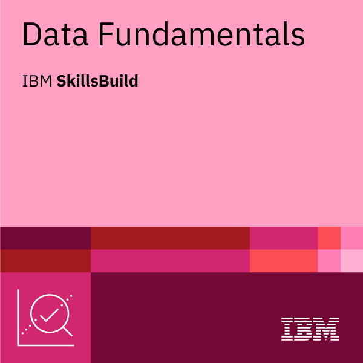
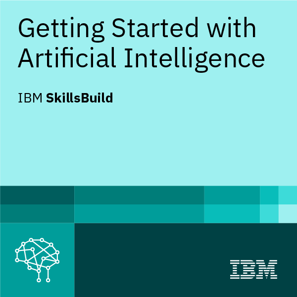

  

<h3 align="center">📈 Estudante de Ciências de Dados e Inteligência Artificial</h3>

Sou estudante de Ciências de Dados e Inteligência Artificial no Centro Universitário Fundação Santo André. 
Apaixonado por transformar dados em insights, busco crescimento e aprendizado constante para me tornar um cientista de dados capaz de gerar soluções impactantes.

---

<h3>🚀 Linguagens e Tecnologias</h3>

---

<h3>🎓 Meus Certificados</h3>

<table>
<tr>
<td align="center">
 
<a href="https://www.credly.com/badges/b93b53c6-f812-4fa8-84e0-a9fe0a17f379/public_url" target="_blank">Ver no Credly</a>
</td>
<td align="center">
 
<a href="https://www.credly.com/badges/3b8e8570-2649-4e90-ad79-cc8e7c84b8bb/public_url" target="_blank">Ver no Credly</a>
</td>
<td align="center">
 
<a href="https://www.credly.com/badges/3dc97af9-188f-4043-8bc0-ef9e58163bbb/public_url" target="_blank">Ver no Credly</a>
</td>
<td align="center">
 
<a href="https://www.credly.com/badges/9cba450e-057b-471a-9765-ba512a606a9b/public_url" target="_blank">Ver no Credly</a>
</td>
</tr>
</table>

---

### 🔭 Projetos
- 🛒 [Análise de dados do supermercado de Mianmar](https://github.com/Raimundo2004/An-lise-supermercado.git)  
- 🛥️ [Análise Titanic](https://github.com/Raimundo2004/An-lise-de-dados-com-a-base-de-dados-do-Titanic.git)  
- 🔢 [Integração de Banco de Dados em Java + MySQL](https://github.com/Raimundo2004/Java-com-BD.git)  
- 🤖 [Machine Learning em Python](https://github.com/Raimundo2004/ML.git)

---

### 📫 Contato
- Email: **relias.neto2004@gmail.com**  
- LinkedIn: [Raimundo Elias dos Santos Neto](https://www.linkedin.com/in/raimundo-elias-dos-santos-neto)

---

<h3>📊 Estatísticas do GitHub</h3>

